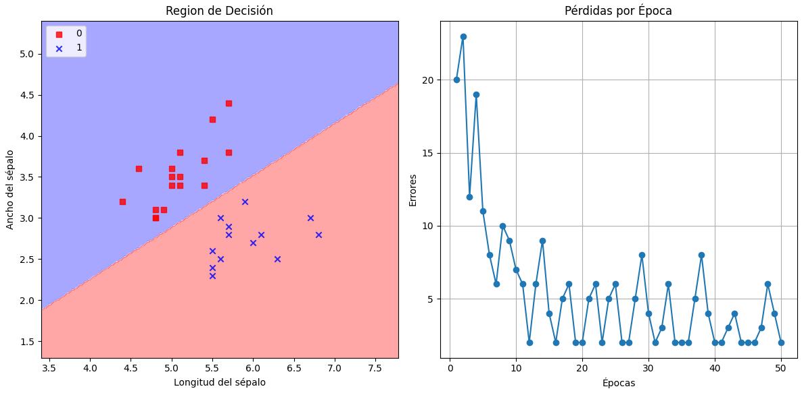

<h1 align="center">IRIS Dataset</h1>

## Descripción del Dataset Iris
El conjunto de datos Iris consta de 150 observaciones de flores de iris, con tres especies diferentes: Iris setosa, Iris versicolor e Iris virginica. Cada observación tiene cuatro características numéricas que describen las mediciones físicas de las flores.

## Características
- Longitud del sépalo (cm)
- Ancho del sépalo (cm)
- Longitud del pétalo (cm)
- Ancho del pétalo (cm)

## Etiquetas
- 0: Iris setosa
- 1: Iris versicolor
- 2: Iris virginica

## Objetivo
El objetivo común al usar este dataset es construir un modelo que pueda clasificar una flor de iris en una de las tres especies basándose en las cuatro características mencionadas.

### Estructura del Dataset
#### Características (X):

Una matriz de 150x4, donde cada fila representa una flor y cada columna representa una de las características (longitud del sépalo, ancho del sépalo, longitud del pétalo, ancho del pétalo).

#### Etiquetas (y):

Un vector de longitud 150, donde cada entrada es una etiqueta que indica la especie de la flor.

```python
from sklearn import datasets

# Cargar el dataset iris
iris = datasets.load_iris()
X = iris.data
y = iris.target

print("Características (X):")
print(X[:5])
print("Etiquetas (y):")
print(y[:5])

```
Resultado
```python
Características (X):
[[5.1 3.5 1.4 0.2]
 [4.9 3.0 1.4 0.2]
 [4.7 3.2 1.3 0.2]
 [4.6 3.1 1.5 0.2]
 [5.0 3.6 1.4 0.2]]
Etiquetas (y):
[0 0 0 0 0]
```

### Uso en Aprendizaje Automático
El conjunto de datos Iris es frecuentemente utilizado para:

- Demostraciones y ejemplos: Ideal para explicar conceptos básicos de clasificación y técnicas de aprendizaje supervisado.
- Pruebas de algoritmos: Es pequeño y fácil de manejar, lo que lo convierte en una buena opción para probar nuevos algoritmos o enfoques.

### Visualización
A menudo se utilizan técnicas de visualización como gráficos de dispersión para observar cómo se distribuyen las diferentes especies de flores en función de sus características. Por ejemplo, se pueden trazar la longitud y el ancho del sépalo para ver cómo se agrupan las especies.
```python
import matplotlib.pyplot as plt

# Gráfico de dispersión de dos características
plt.scatter(X[:, 0], X[:, 1], c=y)
plt.xlabel('Longitud del sépalo (cm)')
plt.ylabel('Ancho del sépalo (cm)')
plt.title('Distribución de las Especies de Iris')
plt.show()

```

### Ejemplo de entrenamiento de Perceptron


#### Importación de librerias
- matplotlib.pyplot para la visualización de datos.
- datasets de sklearn para cargar conjuntos de datos predefinidos.
- numpy para operaciones numéricas.
- train_test_split de sklearn para dividir los datos en conjuntos de entrenamiento y prueba.
- accuracy_score de sklearn para evaluar la precisión del modelo.


```python
import matplotlib.pyplot as plt
from sklearn import datasets
import numpy as np
from sklearn.model_selection import train_test_split
from sklearn.metrics import accuracy_score

```

#### Carga del Dataset Iris
Aquí se carga el dataset "iris", que es un conjunto de datos famoso que contiene información sobre flores. X contiene las características (medidas) y y contiene las etiquetas (tipos de flores).

```python
iris = datasets.load_iris()
X = iris.data
y = iris.target
```
#### Selección de Características y Clases
se seleccionan solo dos tipos de flores y las dos primeras características (longitud y ancho del sépalo). Esto facilita la visualización en dos dimensiones.

```python
X = X[y != 2][:, [0, 1]]
y = y[y != 2]

```

#### División de Datos
X_train, X_test, y_train, y_test = train_test_split(X, y, test_size=0.3, random_state=42)

#### Definición del Perceptrón
define una clase Perceptron, que es un algoritmo simple de aprendizaje supervisado. Tiene un constructor __init__ para inicializar la tasa de aprendizaje y el número de iteraciones. El método fit entrena el perceptrón ajustando los pesos. Los métodos net_input y predict calculan la entrada neta y hacen predicciones, respectivamente.

La funcion predict, compara la entrada neta (la suma ponderada de las entradas) con 0. Si la entrada neta es mayor o igual a 0, la salida es 1; de lo contrario, la salida es 0. Esta comparación actúa como una función escalón, que es una función de activación binaria.

```python
class Perceptron:
    def __init__(self, learning_rate=0.01, n_iterations=50):
        self.learning_rate = learning_rate
        self.n_iterations = n_iterations

    def fit(self, X, y):
        self.weights = np.zeros(1 + X.shape[1])
        self.errors = []

        for _ in range(self.n_iterations):
            errors = 0
            for xi, target in zip(X, y):
                update = self.learning_rate * (target - self.predict(xi))
                self.weights[1:] += update * xi
                self.weights[0] += update
                errors += int(update != 0.0)
            self.errors.append(errors)
        return self

    def net_input(self, X):
        return np.dot(X, self.weights[1:]) + self.weights[0]

    def predict(self, X):
        return np.where(self.net_input(X) >= 0.0, 1, 0)

```

#### Función para Visualizar Regiones de Decisión
```python
def plot_decision_regions(X, y, classifier, resolution=0.02):
    markers = ('s', 'x', 'o', '^', 'v')
    colors = ('red', 'blue', 'lightgreen', 'gray', 'cyan')

    x1_min, x1_max = X[:, 0].min() - 1, X[:, 0].max() + 1
    x2_min, x2_max = X[:, 1].min() - 1, X[:, 1].max() + 1

    xx1, xx2 = np.meshgrid(np.arange(x1_min, x1_max, resolution),
                           np.arange(x2_min, x2_max, resolution))

    Z = classifier.predict(np.array([xx1.ravel(), xx2.ravel()]).T)
    Z = Z.reshape(xx1.shape)

    plt.contourf(xx1, xx2, Z, alpha=0.4, cmap=plt.cm.bwr)
    plt.xlim(xx1.min(), xx1.max())
    plt.ylim(xx2.min(), xx2.max())

    for idx, cl in enumerate(np.unique(y)):
        plt.scatter(x=X[y == cl, 0], y=X[y == cl, 1],
                    alpha=0.8, c=colors[idx], marker=markers[idx], label=cl)
```

#### Entrenamiento del Perceptrón
```python
ppn = Perceptron(learning_rate=0.01, n_iterations=50)
ppn.fit(X_train, y_train)

```

#### Visualización

1. Las regiones de decisión del modelo.
2. El número de errores por cada época durante el entrenamiento.

```python
plt.figure(figsize=(12, 6))

plt.subplot(1, 2, 1)
plot_decision_regions(X_test, y_test, ppn)
plt.title('Region de Decisión')
plt.xlabel('Longitud del sépalo')
plt.ylabel('Ancho del sépalo')
plt.legend(loc='upper left')

plt.subplot(1, 2, 2)
plt.plot(range(1, len(ppn.errors) + 1), ppn.errors, marker='o')
plt.title('Pérdidas por Época')
plt.xlabel('Épocas')
plt.ylabel('Errores')

plt.tight_layout()
plt.show()

```
#### Evaluación del Modelo
```python
y_pred = ppn.predict(X_test)
print('Accuracy: %.2f' % accuracy_score(y_test, y_pred))
```





## Referencias

<a href="https://www.kaggle.com/datasets/uciml/iris" target="_blank">- Kaggle: Iris Dataset </a>


<a href="https://scikit-learn.org/dev/auto_examples/datasets/plot_iris_dataset.html" target="_blank">- Scikit-learn: Iris Dataset </a>