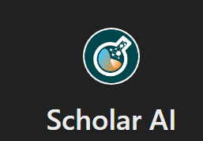
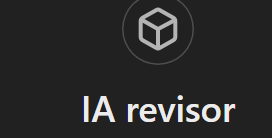

# Prompts for Generating Ideas, Managing, and Creating a Project

### Lista de prompts para proyecto

- Primero definir problemática.
- Definir objetivo de proyecto.

Ejemplo:
```python

Inicie dando respuesta detallada a las siguientes preguntas y si prefiere, estructure un escrito que tenga un hilo conductor entre ellas para tener claridad sobre la necesidad real de crear el producto/servicio:

Qué sucede?
R/ Baja calidad del agua para consumo humano y animales en puerto tejada, con una potabilidad entre 50% y 60%. Altos costos en facturación de agua. Descontento de la comunidad.

Por qué sucede?
R/ No hay planta de tratamiento y acueducto, minería legal e ilegal.


A quiénes afecta?
R/ a la comunidad de Puerto tejada, agricultores y animales de la región


De qué manera?
R/ Con enfermedades, perdida de producción agrícola. 

```

Promt para definición de problema: 
```
como se podria implementar un modelo de IA a la problemática
```

### Redacción de pertiencia
Prompt:
```
Pertinencia del proyecto TI: 
Inicie dando respuesta detallada a las siguientes preguntas y si prefiere, estructure un escrito que tenga un hilo conductor entre ellas para tener claridad sobre la oportunidad real que tiene crear el producto/servicio:

Pertinencia:

Cómo funciona el producto/servicio a desarrollar?
R/ 

En qué beneficia a los usuarios?
R/

Mercado:

Qué tamaño tiene el mercado y la oportunidad? (identifique el perfil de sus clientes, si son personas naturales o empresas, si es para un determinado género, rango de edad, sector de la economía, etc. Especifique lo mayor posible y con ello, estime el tamaño de ése mercado e identifique posibles oportunidades para desarrollo de oferta de otros productos demandados por ése mercado)
R/

Es un mercado en crecimiento? (Apóyese en búsquedas de información de fuentes confiables y especializadas disponibles en la web para sustentar esta respuesta)
R/

Cuáles son las tendencias? (Apóyese en búsquedas de información de fuentes confiables y especializadas disponibles en la web para sustentar esta respuesta)
R/
```
Prompt:
```
 emplea el objetivo "Utilizar IA para analizar los datos recolectados y predecir cambios en la calidad del agua y posibles contaminaciones.", y escribe la pertinencia del proyecto empleando CNN  a partir de un dataset conocido. no hables de drones, iot u sistemas en tiempo real.
```

### Mejorar redacción:
Prompt:
```
emplea citas del documento y reescribe la pertinencia del proyecto con la nueva información, incluye cifras de calidad de agua e inversion 
```
### Estado del arte:


Prompt, para estado del arte en Scholar IA:
```
redacta el estado del arte con relación al tema: "Análisis de Potabilidad del Agua en Puerto Tejada, Cauca mediante CNN". Exscribe la siguiente información: "Nombre producto, Fabricante/País, Qué ventajas tiene frente a mi producto (detallar)
Qué ventaja tiene mi producto frente a este (detallar), Es un competidor Directo o Indirecto?"
```
Prompt complementario, para emplear pdf en la redacción
```
Analizar documentos con IA: "analiza el articulo y extrae la información del estado del arte"
```
### Webs empleadas:

<a href="https://chatgpt.com/" target="_blank">- ChatGPT: Redacción de propuesta </a>


Explore GPTS empleadas




<a href="https://typeset.io/" target="_blank">- Revisión de artículos: ScisPace </a>

<a href="https://ieeexplore.ieee.org/Xplore/home.jsp" target="_blank">- Revisión de artículos: IEEE </a>

<a href="https://www.sciencedirect.com/" target="_blank">- Revisión de artículos: ScienceDirect </a>


### Repositorio de datos (DataSets)

<a href="https://www.kaggle.com/" target="_blank">-Kaggle</a>


<a href="https://archive.ics.uci.edu/" target="_blank">- UC Irvine Machine Learning Repository</a>

<a href="https://www.semanticscholar.org/" target="_blank">- Semantic Scholar </a>

<a href="https://datasetsearch.research.google.com/" target="_blank">-Google Dataset </a>


<a href="https://www.openml.org/" target="_blank">-OpenML</a>

