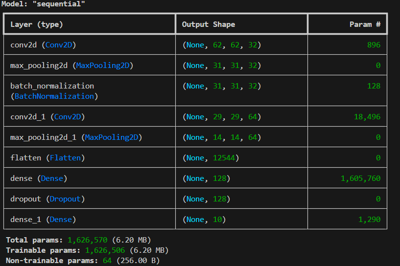

# Capas Ocultas en Redes Neuronales

## Introducción
Las capas, ubicadas entre la capa de entrada y la capa de salida, permiten que la red aprenda representaciones complejas de los datos. A continuación, se describen los tipos de capas ocultas más comunes y sus usos.

### Análisis de datos
### 1. Comprender el Problema y los Datos
Tipo de Problema
- Clasificación: Identificar categorías o clases a partir de los datos.
- Regresión: Predecir valores continuos.
- Procesamiento de Imágenes: Detección de objetos, reconocimiento de patrones.
- Procesamiento de Lenguaje Natural (NLP): Análisis de texto, traducción automática.
- Series Temporales: Predicción de valores futuros en secuencias temporales.
#### Tipo de Datos
- Datos Tabulares: Datos estructurados con filas y columnas.
- Imágenes: Datos visuales en formato de píxeles.
- Texto: Datos en forma de secuencias de caracteres o palabras.
- Datos Secuenciales: Series temporales o secuencias de eventos.
## Tipos de Capas Ocultas
    
### 1. Capa Densa (Dense Layer)

- **Descripción**: También conocida como capa totalmente conectada. Cada neurona está conectada a todas las neuronas de la capa anterior y a todas las de la siguiente capa.
- **Uso**: Comúnmente usada en redes neuronales feedforward,  problemas de clasificación y regresión con datos tabulares.
- **Ejemplo en Keras**:
  ```python
  from tensorflow.keras.layers import Dense
  model.add(Dense(units=64, activation='relu'))

###   2. Capa Convolucional (Convolutional Layer)
Descripción: Utilizada principalmente en redes neuronales convolucionales (CNNs) para tareas de procesamiento de imágenes. Emplea filtros (kernels) que recorren la imagen para extraer características espaciales.
Uso: Procesamiento de imágenes y detección de patrones.
Ejemplo en Keras:

```python
from tensorflow.keras.layers import Conv2D
model.add(Conv2D(filters=32, kernel_size=(3, 3), activation='relu'))
```

### 3. Capa de Pooling (Pooling Layer)
Descripción: Utilizada en CNNs para reducir la dimensionalidad espacial de las características y controlar el sobreajuste.
Tipos Comunes: MaxPooling y AveragePooling.
Ejemplo en Keras:

```python
from tensorflow.keras.layers import MaxPooling2D
model.add(MaxPooling2D(pool_size=(2, 2)))
```

### 4. Capa Recurrente (Recurrent Layer)
Descripción: Empleada en redes neuronales recurrentes (RNNs) para datos secuenciales como series temporales o texto.
Tipos Comunes: LSTM (Long Short-Term Memory) y GRU (Gated Recurrent Unit).
Ejemplo en Keras:

```python
from tensorflow.keras.layers import LSTM
model.add(LSTM(units=50, activation='tanh'))
```

### 5. Capa de Normalización por Lotes (Batch Normalization Layer)
Descripción: Normaliza la salida de una capa anterior dividiéndola por su desviación estándar, estabilizando y acelerando el entrenamiento.
Ejemplo en Keras:

```python
from tensorflow.keras.layers import BatchNormalization
model.add(BatchNormalization())
```

### 6. Capa de Dropout (Dropout Layer)
Descripción: Previene el sobreajuste al "desactivar" aleatoriamente una fracción de neuronas durante el entrenamiento.
Ejemplo en Keras:

```python
from tensorflow.keras.layers import Dropout
model.add(Dropout(rate=0.5))

```

### 7. Capa Embedding (Embedding Layer)
Descripción: Común en modelos que manejan datos categóricos, especialmente en procesamiento de lenguaje natural (NLP). Transforma entradas categóricas en vectores densos de menor dimensión.
Ejemplo en Keras:

```python
from tensorflow.keras.layers import Embedding
model.add(Embedding(input_dim=10000, output_dim=128))

```

### Ejemplo de aplicación:
```python
import tensorflow as tf
from tensorflow.keras.models import Sequential
from tensorflow.keras.layers import Dense, Conv2D, MaxPooling2D, Flatten, Dropout, LSTM, BatchNormalization

model = Sequential()

# Capa convolucional y de pooling
model.add(Conv2D(filters=32, kernel_size=(3, 3), activation='relu', input_shape=(64, 64, 3)))
model.add(MaxPooling2D(pool_size=(2, 2)))

# Capa de normalización por lotes
model.add(BatchNormalization())

# Otra capa convolucional y de pooling
model.add(Conv2D(filters=64, kernel_size=(3, 3), activation='relu'))
model.add(MaxPooling2D(pool_size=(2, 2)))

# Aplanar las características para conectarlas a capas densas
model.add(Flatten())

# Capas densas
model.add(Dense(units=128, activation='relu'))

# Capa de dropout
model.add(Dropout(rate=0.5))

# Capa de salida para clasificación multiclase
model.add(Dense(units=10, activation='softmax'))

# Compilar el modelo
model.compile(optimizer='adam',
              loss='categorical_crossentropy',
              metrics=['accuracy'])

# Resumen del modelo
model.summary()

```
### Resultados


<!-- https://www.tensorflow.org/datasets/catalog/mnist -->