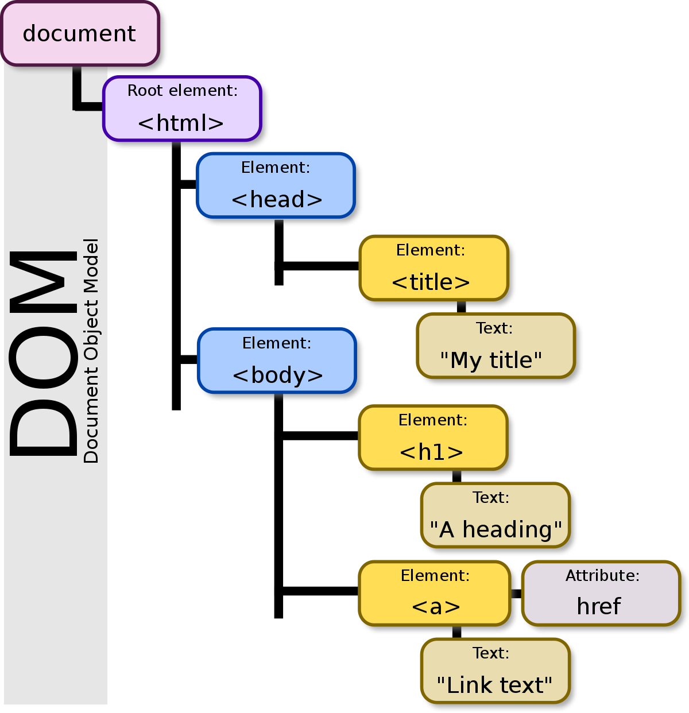

El DOM (Document Object Model) es una representación estructurada y jerárquica de un documento HTML (u otro tipo de documento como XML) que permite a los programas acceder y manipular dinámicamente el contenido, la estructura y el estilo del documento.

Características Clave del DOM:
Estructura Jerárquica: El DOM organiza el documento como una estructura de árbol donde cada elemento HTML (como etiquetas <html>, <body>, <div>, etc.) se representa como un nodo en el árbol.

Acceso a Elementos: Permite acceder a cada elemento individual dentro del documento, lo que facilita la manipulación del contenido y los atributos de cada elemento mediante código JavaScript o bibliotecas como BeautifulSoup en Python.

Modelo Orientado a Objetos: Cada nodo en el DOM es un objeto con propiedades y métodos que permiten modificar su contenido, estilo y comportamiento dinámicamente. Por ejemplo, puedes cambiar el texto dentro de un <p> o añadir una clase a un <div> utilizando métodos proporcionados por el DOM.

Interacción Dinámica: Es la base para interactuar dinámicamente con la página web después de que se ha cargado inicialmente. Esto incluye cambios de contenido, estilo o incluso eventos como clics de botones que afectan al DOM.
```html
<!DOCTYPE html>
<html>
<head>
    <title>Ejemplo DOM</title>
</head>
<body>
    <div id="content">
        <p>Hola, <span>mundo</span>!</p>
    </div>
</body>
</html>

```
https://beautiful-soup-4.readthedocs.io/en/latest/